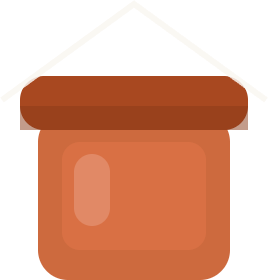
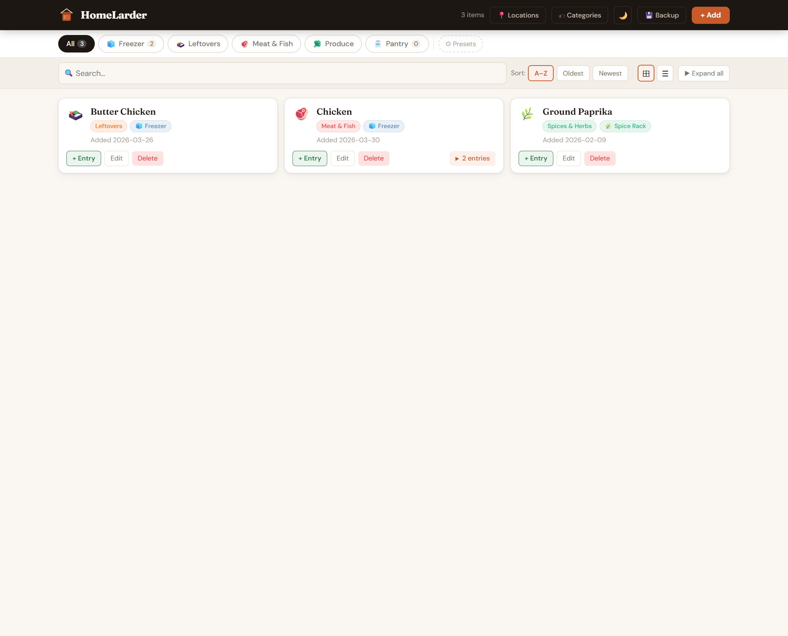
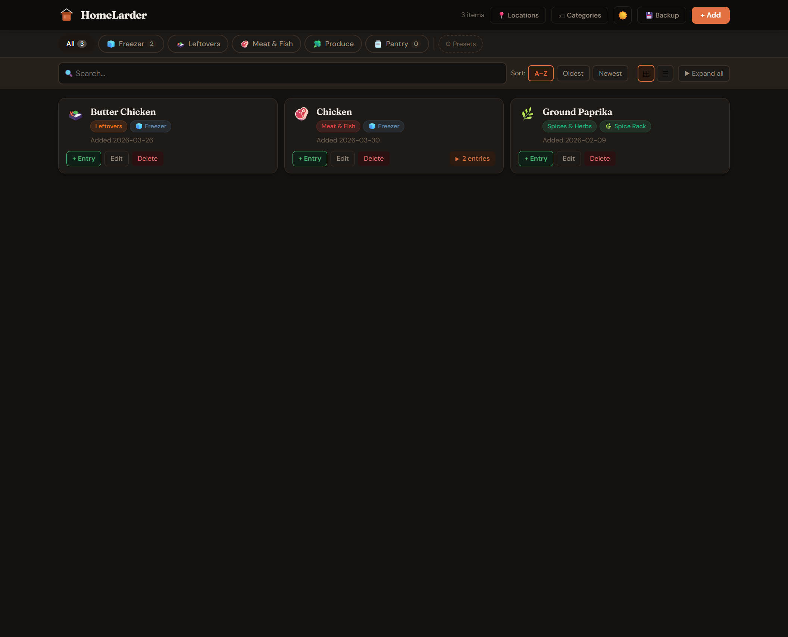
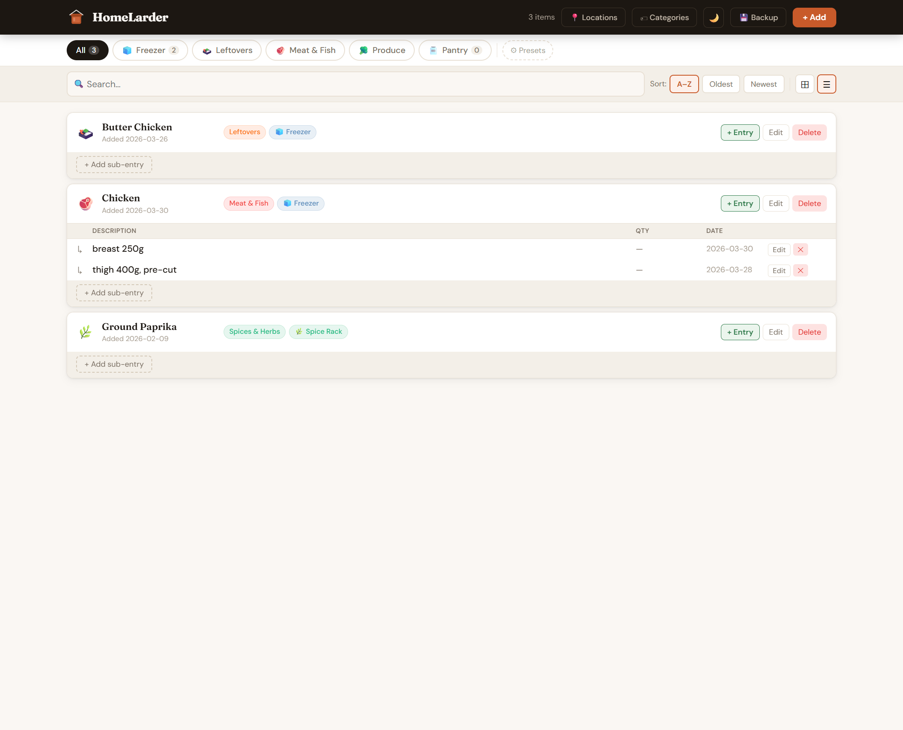
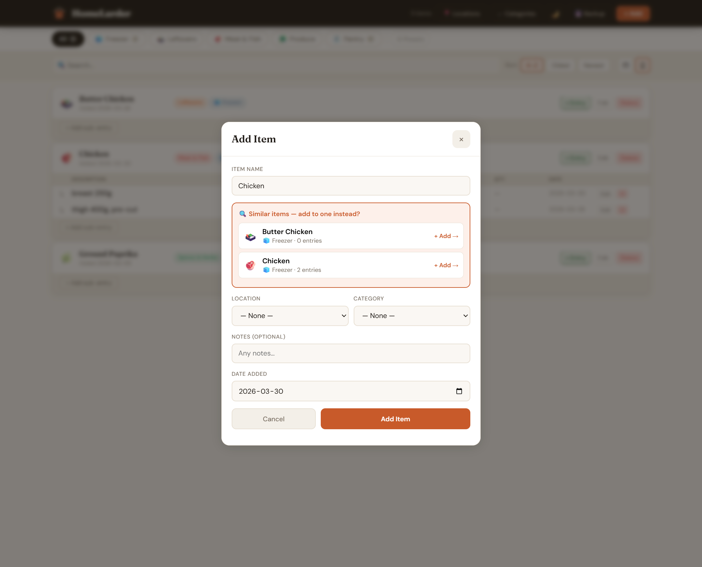
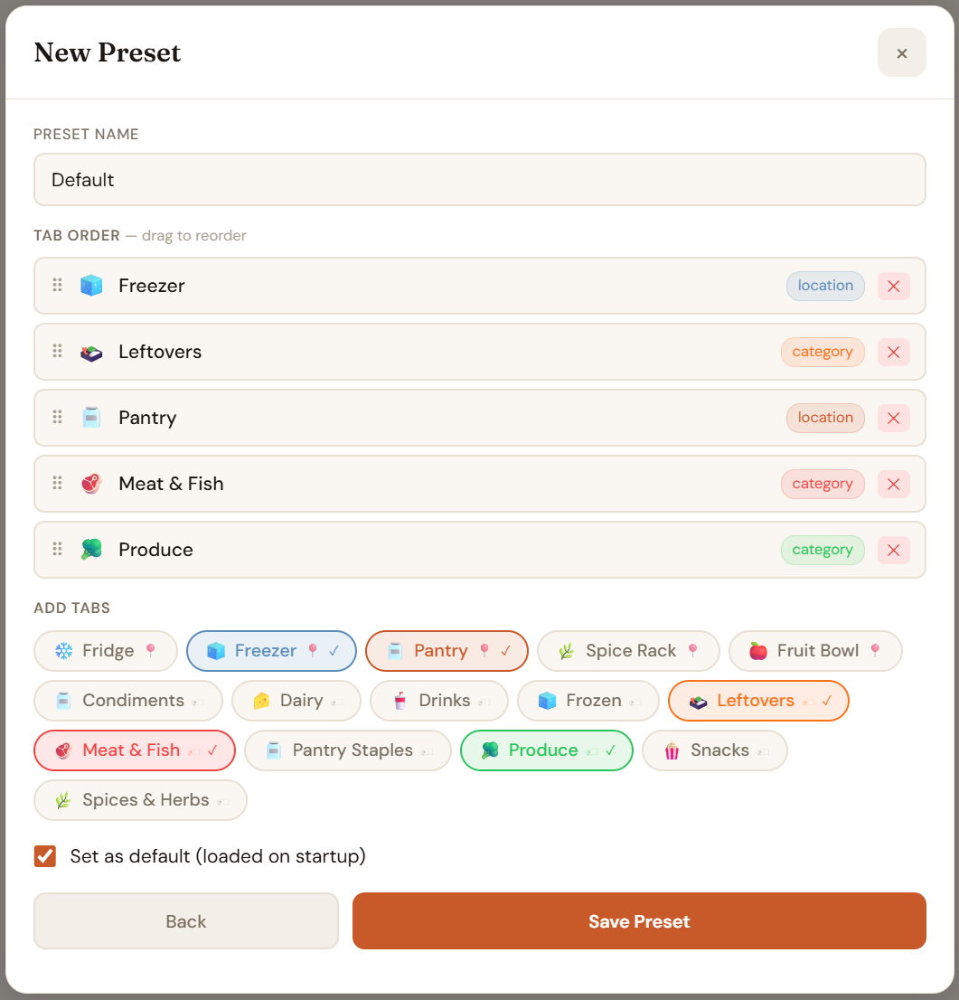
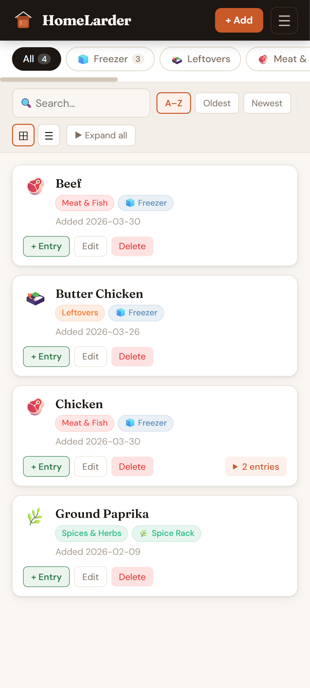
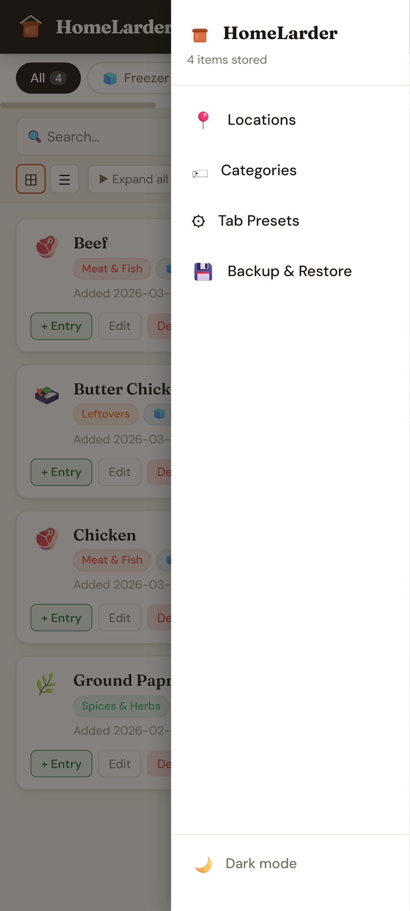

#  HomeLarder

A fully vibe-coded, self-hosted Docker app to track what's in your fridge, freezer, pantry, and anywhere else you store food.

## Quick Start

```bash
git clone https://github.com/david-blackwell/HomeLarder
cd HomeLarder
docker-compose up -d
```

Open **http://localhost:4580** in your browser.

---

## Screenshots

### Card view & List view

<table>
  <tr>
    <td></td>
    <td></td>
  </tr>
  <tr>
    <td align="center">Card view — light mode</td>
    <td align="center">Card view — dark mode</td>
  </tr>
</table>



*List view — sub-entries shown inline as a table*

### Adding items

<table>
  <tr>
    <td></td>
    <td></td>
  </tr>
  <tr>
    <td align="center">Smart similar-item detection</td>
    <td align="center">Tab preset editor with drag-to-reorder</td>
  </tr>
</table>

### Mobile

<table>
  <tr>
    <td></td>
    <td></td>
  </tr>
  <tr>
    <td align="center">Card view — light mode</td>
    <td align="center">Card view — dark mode</td>
  </tr>
</table>

---

## Features

- **Locations** — fully configurable (add/rename/reorder/delete). Defaults: Fridge, Freezer, Pantry, Spice Rack, Fruit Bowl
- **Categories** — fully configurable with emoji + colour
- **Tab presets** — save named sets of tabs mixing locations and categories in any order, set a default that loads on startup. Stored server-side so the same on every device. Drag to reorder on desktop, tap arrows on mobile
- **Sub-entries** — e.g. Chicken → breast 250g, thigh 400g cut up, etc.
- **Inline quantity stepper** — +/− buttons directly on each sub-entry row for quick count adjustments, alongside a free-text unit field (e.g. "3 bags")
- **Smart suggestions** — as you type a new item name, similar existing items appear so you can add a sub-entry instead of a duplicate
- **Auto delete** — when removing the last quantity from a sub-entry, or the last sub-entry from an item, a pop will ask if you want to delete the sub-entry or item
- **Search** — searches both item names and sub-entry descriptions
- **Date tracking** — adjustable date added field for each item and sub-entry
- **Sort** — A–Z, Oldest first, Newest first
- **Card view + Row/table view**
- **Expand all** toggle in card view
- **Dark mode** — per-device preference saved locally
- **Backup & Restore** — full JSON export/import via the UI
- **Mobile friendly** — full-screen modals, hamburger menu, single-column layout

## Changing the port

Edit `docker-compose.yml`:

```yaml
ports:
  - "9000:80"   # change 4580 to whatever you want, e.g 9000
```

Then `docker-compose up -d`.

---

## Where is my data?

By default HomeLarder uses a **named Docker volume** (`homelarder-data`). Docker manages this volume internally.

### Option A — Use the built-in Backup feature (easiest)

In the app, click **💾 Backup** in the header (or via the ☰ menu on mobile) to download a full JSON backup. You can restore from the same screen.

### Option B — Switch to a bind mount

Edit `docker-compose.yml` and swap the volume lines:

```yaml
volumes:
  # Comment this out:
  # - homelarder-data:/data

  # Uncomment this:
  - ./data:/data
```

Then restart:

```bash
docker-compose down
docker-compose up -d
```

Your database will now live at `./data/larder.db` (customisable) right next to your `docker-compose.yml`.

---

## Development (without Docker)

```bash
# Terminal 1 — backend
cd backend && npm install && node server.js

# Terminal 2 — frontend
cd frontend && npm install && npm start
```

The frontend proxies `/api` to `localhost:3001` in dev mode.
